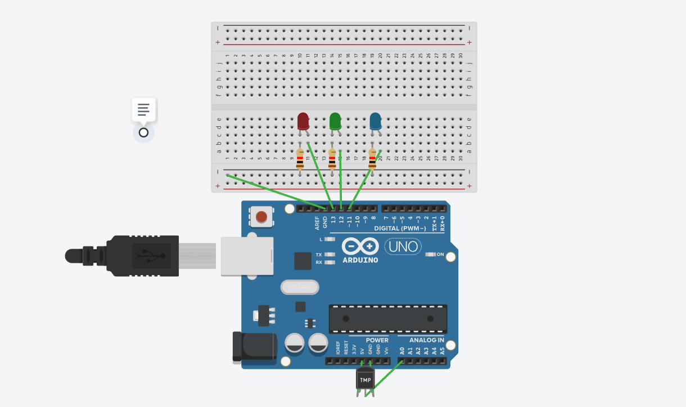

# IoT Smart Incubator Monitoring System 🏥

### Project Overview
A simulated medical system designed to monitor neonatal incubator environments. It integrates embedded hardware (Arduino) with a Python-based central station for real-time safety alerts and data logging.

### Tech Stack
* **Hardware:** Arduino Uno, TMP36 Sensor (Simulated in Tinkercad).
* **Software:** Python 3.10, Pandas (Data Analysis), Matplotlib (Viz), Tkinter (GUI).
* **Protocol:** Serial Communication & CSV Logging.

### Features
* **Automated Safety Logic:** Triggers Red/Blue LED alarms for Hyperthermia/Hypothermia.
* **Medical Dashboard:** A GUI for doctors to load patient history and view stability graphs.
* **Audit Trail:** Automatically logs vital signs to CSV for compliance.

### Architecture

### Results
The system successfully detects rapid temperature spikes (>37.5°C) and provides visual analytics for post-event review.

